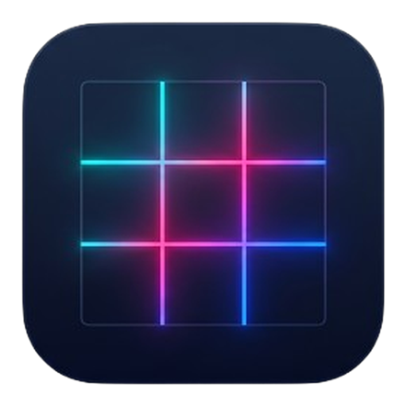

  
  <h1>WindowFlow</h1>
  

    <b>Tidy your windows at the speed of thought.</b> 
    A fast, native macOS window manager that lives in your menu bar — never in your Dock.
  

  

    <a href="https://github.com/3gksoftware/windowflow/releases/latest/download/WindowFlow.dmg"><b>⬇&nbsp;&nbsp;Download for macOS</b></a>
    &nbsp;·&nbsp;
    <a href="#-installation">Installation</a>
    &nbsp;·&nbsp;
    <a href="#-keyboard-shortcuts">Shortcuts</a>
    &nbsp;·&nbsp;
    <a href="https://github.com/3gksoftware/windowflow/releases">Changelog</a>
  

  

    
    
    
    
    
    
  

---

On a big display — or several — a window left at its default size is wasted space, and dragging its edges by hand is wasted time. **WindowFlow** removes that friction: one keystroke and the frontmost window snaps to exactly the left half, a quarter, a third, or the whole screen. Press again to cycle to the next useful variant. Need it on your other monitor? One shortcut.

It's the spirit of the classics (Rectangle, Magnet…), rebuilt **100% native**, **light** (a few megabytes), and **private by design**: no account, no ads, no tracking — everything stays on your Mac.

## ✨ Features

- ⌨️ **23 placement actions** — halves, quarters, thirds, maximize, and centering.
- 🔁 **Smart cycling** — press the same shortcut again to step through useful variants.
- 🖱️ **Drag-to-snap** *(optional)* — drag a window onto a target that appears in the center of each screen.
- 🖥️ **First-class multi-monitor** — every calculation respects the screen a window is on, and two shortcuts move it between displays.
- ⚙️ **Fully remappable shortcuts** — sensible defaults out of the box, yours to change.
- 📏 **Adjustable spacing (gaps)** — between windows and screen edges.
- 🚀 **Launch at login** — one click.
- 🧭 **Guided onboarding** — grant the required permission in seconds.
- 🌍 **English & French** — follows your system language.
- 🔄 **Automatic updates** — built in and cryptographically signed.
- 🪶 **Unobtrusive** — lives in the menu bar, nothing in the Dock.

## 📦 Installation

1. **[Download the latest `.dmg`](https://github.com/3gksoftware/windowflow/releases/latest/download/WindowFlow.dmg).**
2. Open it and **drag WindowFlow into your Applications folder**.
3. Launch it — a small ▦ icon appears in your menu bar (nothing in the Dock).
4. Grant the **Accessibility** permission when prompted. The built-in welcome screen opens the right pane of System Settings for you and detects the change instantly — no restart needed.

> WindowFlow is **signed with an Apple Developer ID and notarized by Apple**, so macOS opens it without any “unidentified developer” warning.

## ⌨️ Keyboard shortcuts

Every shortcut is **global** (it works no matter which app is active) and **fully remappable** under *Settings › Shortcuts*. The defaults follow Rectangle (Control + Option + key):

| Action | Default |
|---|---|
| Left / right / top / bottom half | `⌃⌥←` / `⌃⌥→` / `⌃⌥↑` / `⌃⌥↓` |
| Quarters (top‑left / top‑right / bottom‑left / bottom‑right) | `⌃⌥U` / `⌃⌥I` / `⌃⌥J` / `⌃⌥K` |
| First / center / last third | `⌃⌥D` / `⌃⌥F` / `⌃⌥G` |
| First / last two‑thirds | `⌃⌥E` / `⌃⌥T` |
| Maximize | `⌃⌥↩` |
| Maximize height | `⌃⌥⇧↑` |
| Center | `⌃⌥C` |
| Grow / shrink | `⌃⌥=` / `⌃⌥-` |
| Next / previous display | `⌃⌥⌘→` / `⌃⌥⌘←` |
| Restore | `⌃⌥⌫` |

*Center‑half* and *almost‑maximize* ship without a default shortcut — assign your own in the Shortcuts tab.

<b>Cycling — press again to refine (Rectangle‑style)</b>

 

Pressing the same shortcut repeatedly steps through coherent variants, so you can fine‑tune without memorizing ten combinations:

| Starting shortcut | Cycle |
|---|---|
| **Left half** | left half → first third → first two‑thirds → (repeat) |
| **Right half** | right half → last third → last two‑thirds → (repeat) |
| **Top half** | top half → top‑left quarter → top‑right quarter → (repeat) |
| **Bottom half** | bottom half → bottom‑left quarter → bottom‑right quarter → (repeat) |
| **Maximize** | maximize → almost‑maximize → center‑half → (repeat) |

The cycle **resets automatically** when the frontmost window changes or after ~2 seconds of inactivity — so you always start fresh.

## 🖱️ Drag‑to‑snap *(optional, experimental)*

Beyond the keyboard, WindowFlow offers an opt‑in drag mode (off by default). Once enabled, the moment you **start moving** a window, a translucent box appears **in the center of every connected screen**, split into a left and a right zone. Hover a zone to highlight it, **release** the window inside, and it snaps to the matching **half of that box’s screen** — including a different display than where you started. Release **outside** the boxes and nothing happens: you’re always free to snap… or not.

## 📏 Spacing (gaps)

A single **spacing** setting adds a configurable margin between windows and the screen edges. At `0`, windows sit flush; increase it for tidy, even gutters between tiled windows. The value applies to **every** placement calculation.

## 🔄 Automatic updates

WindowFlow checks for new versions on its own and offers a **Check for Updates…** menu item any time. Updates are **cryptographically signed and verified** before installation, so you only ever receive authentic builds.

## 🔒 Privacy

- **No data collection.** No account, no ads, no trackers.
- All processing is **local** to your Mac; the only network request is the update check.
- The **Accessibility** permission is used solely for what it says — moving and resizing windows. Nothing else is read or recorded.

## 💻 Requirements

- **macOS 13 (Ventura)** or later.
- **Apple Silicon** Mac (arm64).
- The **Accessibility** permission (guided on first launch).

---

  Made with care by <b>3GK Software</b>. This repository hosts WindowFlow’s downloads and release notes. 
  © 2026 3GK Software — WindowFlow.

